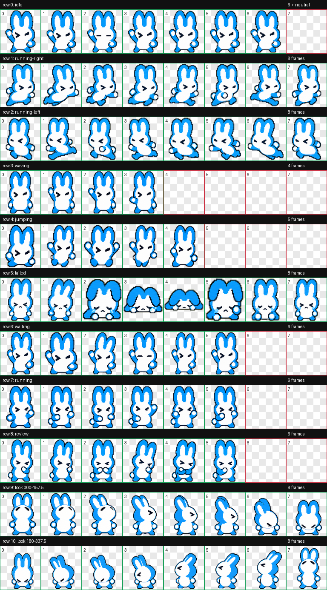

# utoo-codex-pet

Utoo is a custom Codex desktop pet generated from the [Utoo](https://github.com/utooland/utoo) / utoopack visual references. It is a compact blue-and-white bunny-like mascot with pixel-adjacent Codex pet styling.

Utoo 是一个基于 [Utoo](https://github.com/utooland/utoo) / utoopack 视觉参考生成的 Codex 桌面宠物。它保留了蓝白兔形轮廓，并整理成可本地安装、分享和复用的目录仓库。

## Preview

| State | Preview | Frames |
| --- | --- | --- |
| Idle |  | 6 |
| Running Right |  | 8 |
| Running Left |  | 8 |
| Waving |  | 4 |
| Jumping |  | 5 |
| Failed |  | 8 |
| Waiting |  | 6 |
| Running |  | 6 |
| Review |  | 6 |

Full QA contact sheet:



## Install

From this repository:

```bash
bash scripts/install_utoo.sh
```

The pet will be installed to:

```bash
${CODEX_HOME:-$HOME/.codex}/pets/utoo
```

Then restart Codex or refresh the pet list and select `Utoo`.

## Included

- `SKILL.md`: Codex skill instructions for installing this pet.
- `scripts/install_utoo.sh`: local installer.
- `assets/utoo/pet.json`: pet metadata.
- `assets/utoo/spritesheet.webp`: Codex-ready animation atlas.
- `assets/utoo/spritesheet.png`: PNG copy of the atlas for inspection.
- `assets/utoo/source-mapping.json`: generation and row mapping metadata.
- `assets/previews/*.png`: first-frame previews for README browsing.
- `assets/qa/contact-sheet.png`: full row-by-row QA sheet.
- `assets/qa/videos/*.mp4`: per-state animation previews.
- `assets/references/*.png`: source and canonical reference images used for generation.

## Validation

The final atlas was validated with the `hatch-pet` QA pipeline:

- Atlas: 1536 x 1872, RGBA WebP.
- Cell size: 192 x 208.
- Rows: 9.
- Validation errors: 0.
- Validation warnings: 0.

## Notes

`running-left` was derived by deterministic mirroring from `running-right`; the source mascot has no readable text, side-specific marking, or handed prop, so mirroring preserves the pet identity and direction semantics.
